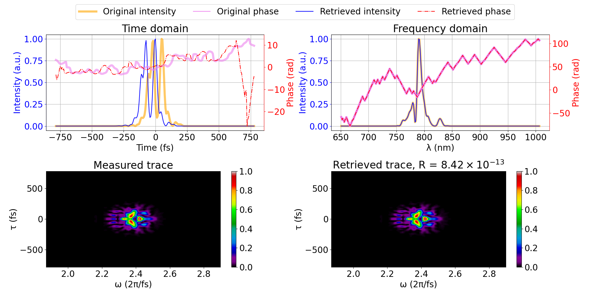

# Ultrafast Pulse Retrieval

This module aims to implement some pulse retrieval algorithms for SHG-FROG traces in C++ language for speed purposes (although the code is not optimized).

This module is highly inspired in Nils C. Geib work in the Python module "PyPret" [(link to the GitHub repo)](https://github.com/ncgeib/pypret) and the paper ["Common pulse retrieval algorithm: a fast and universal method to retrieve ultrashort pulses"](https://opg.optica.org/optica/fulltext.cfm?uri=optica-6-4-495&id=408956). Check it out for more in detail info about the retrievers and the formalism. The code follows PyPret's philosophy and also tries to follow its name convention.

## Supported retrieval algorithms

Currently there are three different working retrieval algorithms for SHG-FROG traces:

* Generalized Projections Algorithm (GPA)
* Ptycographic Iterative Engine (PIE)
* Common Phase Retrieval Algorithm (COPRA)



## Experimental retrieval

The development of the code has taken into account both theoretical retrieval and retrieval of experimental measurements.

Some experimentally measured traces retrieval can be found inside ```./tests/expResults/```. A setup bash script has been developed to call the file ```./tests/expResults/retrieveExpResults.cpp``` with the retrieval parameters and filenames containing the measuring axis and measured trace, that also calls a Python script to do the plotting.

To use this script for your own experimental meaures, create a file for the measuring axes which contain the angular frequency values in the first column and the delay values in the second column, both being separated by a comma; and a separate file which contains the trace values (N values per row, N rows in total). Pay attention to the correct trace orientation when retrieving.

## Random pulse retrieval

The random pulse generator created by Nils C. Geib in PyPret has been implemented.

Inside ```./tests/``` a setup bash script can be found. This script calls ```testRetrievers.cpp``` and plots the result of the retrieval by the ```plotRetrievalResults.py``` script.

This script retrieves a randomly generated pulse of a specified time-bandwidth product. Noise can be added to this pulse trace so performance of different retrieval algorithms can be benchmarked in presence of gaussian noise.

## Random pulse database

The random pulse generation can be used to create a database of pulses and its corresponding traces. See an example of it in ```./tests/testDataBaseGeneration.cpp```

## Documentation

The core classes and methods from `src` are properly documented. I'm thinking about making a document/web including all the references and some examples, but for now, this will do.

Some examples of how the different classes work can be found inside the ```./tests``` folder.

## Compilation

The code calls [fftw](https://www.fftw.org/) library to compute fast fourier transforms. Make sure to include the corresponding flag when compiling the programs.

## Author

This code has been developed by Víctor Loras Herrero in the framework of the master's thesis inside the master's degree in mathematical modeling and research, statistics and computation of the University of Zaragoza.

It has been highly inspired by Neils C. Geib on [PyPret](https://github.com/ncgeib/pypret).

For any questions or comments, you can contact me via email: <vloras@unizar.es>

## License

This project is licensed under the Apache License - see the [LICENSE](LICENSE) file for details.
